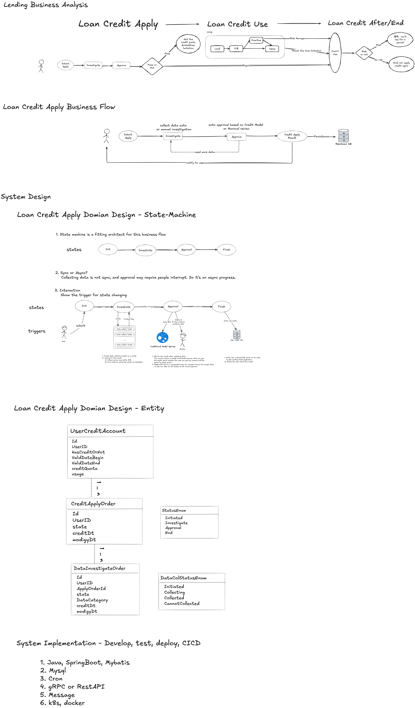

# 1. Project Purpose
With over 9 years of experience as a software developer in a company, where most 
development relied on internal platforms, and direct use of open-source tools was limited, I built this demo loan credit application system to combine my work experience with modern open-source frameworks and DevOps practices.

### 1.1 Development stack
- Spring Boot
- MyBatis with MySQL
- Redis for distributed locking
- Swagger for API documentation

### 1.2 Infrastructure (IaaS)
- Azure managed services for MySQL and Redis to reduce infrastructure maintenance
- Azure Web Service for deploying and hosting the application

### 1.3 DevOps
- GitHub for code hosting
- GitHub Action for CI/CD pipeline that builds and packages container images, and pushing image to ACR
- Using spring.profiles.active config and Azure Environment variables to manage multiple environment

### 1.4 Todo
- Implement automated Kubernetes deployment using Helm and Argo CD for multi-region disaster recovery
- Integrate Prometheus and Grafana for enhanced observability and monitoring
- Test Framework: Junit + Mockito + Spring Boot Test

Additionally, this project serves as a portfolio piece to demonstrate my comprehensive understanding and experience in software engineering, aiming to support my pursuit of freelance opportunities.

# 2. Play with this system
### 2.1 start mysql
```shell
brew services start mysql
brew services stop mysql

login on the terminal
  mysql -u root -p
```

### 2.2 create database and table
1. sql for creating table you can find in src/main/resources/schema.sql
2. modify the JDBC config in application-local.properties

### 2.3 start redis[optional]

### 2.4 start application
    com.loan.approve.ApprovalApplication.main

### 2.5 visit URL using swigger
```
http://localhost:8080/swagger-ui/index.html
```


# 3. System Design
This system is part of the overall loan business domain, focusing specifically on people applying for a credit limit. 
The brief pipeline is as follows: 
First, users submit their application and sign an agreement authorising the bank or service provider to collect and verify their information. 
Second, the bank or service provider gathers this information through various methods. 
Third, the bank or service provider reviews and approves the application based on the applicant’s information. 
Nowadays, the approval step is mostly driven by a credit scoring model, which has been trained on large amounts of data.

